<div align="center">
  
</div>

---

<div align="center">

# 📐 DOTSKILLS
## Software Requirements Specification

**Enterprise Business Management & CRM Platform**

---

🏢 

---

| | |
|---|---|
| 📄 **Document Type** | Software Requirements Specification (SRS) |
| 🔖 **Version** | v1.0.0 |
| 📅 **Date** | August 1, 2026 |
| ✍️ **Author** | DotSkills Product & Engineering Team |
| 🏷️ **Status** | 🟢 Active — Living Document |
| 🔐 **Classification** | Confidential — Internal & Authorized Client Use Only |

</div>

---

> ## 🔒 Confidentiality Notice
> This document and all information contained herein are the confidential and proprietary property of **DotSkills**. It is intended solely for the use of the individual or entity to whom it is addressed — including authorized clients, investors, development partners, and internal stakeholders. Any unauthorized review, distribution, copying, or disclosure of this document, in whole or in part, is strictly prohibited without prior written consent from DotSkills. This is a **living document** and is subject to revision as the product evolves.

---

## 📋 Revision History

| Version | Date | Author | Description of Changes | Status |
|:---|:---|:---|:---|:---:|
| 0.1.0 | 2026-05-12 | Product Team | Initial draft — scope & tech stack | 🔵 Draft |
| 0.5.0 | 2026-06-20 | Engineering Team | Added Auth, RBAC, User & Lead modules (post-implementation) | 🔵 Draft |
| 0.8.0 | 2026-07-18 | Product & QA | Added roadmap, feature matrix, NFRs, test strategy | 🟡 Review |
| **1.0.0** | **2026-08-01** | **DotSkills Product & Engineering Team** | **Full baseline release — all modules, diagrams, roadmap** | 🟢 **Approved** |

---

## 📚 Table of Contents

1. [Executive Summary](#1-executive-summary)
2. [Technology Stack](#2-technology-stack)
3. [System Architecture](#3-system-architecture)
4. [Database Overview](#4-database-overview)
5. [Authentication Module](#5-authentication-module-) ✅
6. [User Management Module](#6-user-management-module-) ✅
7. [Lead Management Module](#7-lead-management-module-) ✅
8. [Dashboard](#8-dashboard)
9. [Public Website Documentation](#9-public-website-documentation)
   - 9.1 [Home](#91-home) · 9.2 [About](#92-about) · 9.3 [Services](#93-services) · 9.4 [Courses](#94-courses)
   - 9.5 [Projects](#95-projects) · 9.6 [Blog](#96-blog) · 9.7 [Career](#97-career) · 9.8 [Contact](#98-contact)
   - 9.9 [FAQ](#99-faq) · 9.10 [Privacy Policy](#910-privacy-policy) · 9.11 [Terms of Service](#911-terms-of-service) · 9.12 [Cookie Policy](#912-cookie-policy)
10. [Dashboard Modules](#10-dashboard-modules)
    - 10.1 [Client Management](#101-client-management) · 10.2 [Company Management](#102-company-management) · 10.3 [Project Management](#103-project-management)
    - 10.4 [Task Management](#104-task-management) · 10.5 [Calendar](#105-calendar) · 10.6 [Finance](#106-finance) · 10.7 [HR](#107-hr)
    - 10.8 [Course Management](#108-course-management) · 10.9 [Student Management](#109-student-management) · 10.10 [Certificate Management](#1010-certificate-management)
    - 10.11 [Blog CMS](#1011-blog-cms) · 10.12 [Media Library](#1012-media-library) · 10.13 [Support Ticket](#1013-support-ticket-system)
    - 10.14 [Notifications](#1014-notifications) · 10.15 [Reports](#1015-reports) · 10.16 [Audit Logs](#1016-audit-logs)
    - 10.17 [System Settings](#1017-system-settings) · 10.18 [Profile](#1018-profile)
11. [Shared Components](#11-shared-components)
12. [Shared Utilities](#12-shared-utilities)
13. [AI Roadmap](#13-ai-roadmap-future)
14. [Integrations](#14-integrations)
15. [Development Roadmap](#15-development-roadmap)
16. [Feature Status Matrix](#16-feature-status-matrix)
17. [Priority Matrix](#17-priority-matrix)
18. [Risk Assessment & Mitigation](#18-risk-assessment--mitigation)
19. [Non-Functional Requirements](#19-non-functional-requirements)
20. [Testing Strategy](#20-testing-strategy)
21. [Deployment Architecture](#21-deployment-architecture)
22. [Appendix](#22-appendix)

---

# 1. Executive Summary

## 1.1 Project Overview

**DotSkills Panel** is an enterprise-grade, all-in-one business management platform being built to unify DotSkills' internal operations — sales, client relationships, project delivery, finance, HR, and its education arm (courses, students, certification) — inside a single, permission-aware workspace. It replaces a patchwork of spreadsheets, disconnected tools, and manual handoffs with one system of record.

The platform ships as two coordinated surfaces:

- **DotSkills Public Website** — the marketing and lead-generation front door (Home, Services, Courses, Blog, Careers, etc.)
- **DotSkills Panel (Staff Dashboard)** — the internal, role-gated workspace where the team runs the business day to day.

> 💡 **Positioning:** Think "Notion's clarity + HubSpot's CRM depth + Vercel's engineering polish" — purpose-built for a services-and-education business rather than adapted from generic eCommerce tooling.

## 1.2 Business Goals

| Goal | Description |
|---|---|
| 🎯 **Centralize operations** | One source of truth for leads, clients, projects, tasks, and finance — no more scattered spreadsheets. |
| 📈 **Increase conversion** | Structured lead pipeline with assignment, scoring-ready data, and timeline tracking to shorten sales cycles. |
| 🔐 **Enforce accountability** | Role-based access control (RBAC) and audit logging so every action is attributable and every permission is deliberate. |
| ⚙️ **Reduce operational overhead** | Automate repetitive admin work — invoicing, certificate issuance, notifications — freeing staff time for higher-value work. |
| 🎓 **Support the education business** | First-class modules for courses, students, and certificates, not bolted onto a generic CRM. |
| 🤖 **Future-proof with AI** | Architecture and data model designed so AI-assisted features (Section 13) can be layered in without a rebuild. |

## 1.3 Target Users

| User Type | Description | Primary Needs |
|---|---|---|
| 👑 **Super Admin** | Platform owner(s); unrestricted access | Full system control, org-wide visibility |
| 🛡️ **Admin** | Senior operations/management staff | Cross-module management, reporting, user administration |
| 🧭 **Manager** | Team leads across sales/delivery | Team performance, project & lead oversight, approvals |
| 💻 **Developer / 🎨 Designer** | Delivery staff | Their assigned tasks/projects, time logging, file access |
| 📣 **Marketer** | Growth & content staff | Leads, blog CMS, campaign-adjacent reporting |
| 🧑‍💼 **Staff** | General employees | Personal tasks, profile, attendance/leave (HR) |
| 🌐 **Public Visitor** | Prospects browsing the public site | Service info, course catalog, contact/lead forms |
| 🎓 **Student** *(future portal)* | Enrolled learners | Course access, certificates, progress |

## 1.4 Expected Outcomes

- ✅ A single authenticated workspace covering the full lead-to-cash lifecycle.
- ✅ Reduction in lead response time and improved lead-to-client conversion visibility.
- ✅ Auditable, role-correct access across every module — no shared logins, no blind spots.
- ✅ A public website that feeds qualified leads directly into the CRM pipeline with zero manual re-entry.
- ✅ A modular architecture (Section 3) that lets Phases 2–5 (Section 15) ship incrementally without regressions to completed modules.
- ✅ A documentation baseline (this SRS) that development, QA, and stakeholders can all work from as the single source of truth.

## 1.5 Current Delivery Status Snapshot

| Module | Status |
|---|:---:|
| Authentication & Authorization (RBAC) | 🟢 Completed |
| User Management | 🟢 Completed |
| Lead Management | 🟢 Completed |
| Dashboard Layout (shell, navigation, foundation) | 🟢 Completed |
| Settings Foundation | 🟢 Completed |
| Everything else in Sections 8–14 | 🔵 Planned per roadmap (Section 15) |

---

# 2. Technology Stack

> 📌 **Callout — Why this stack:** Every choice below optimizes for one thing — a small team shipping a large surface area of CRUD-heavy modules without sacrificing type-safety, performance, or UI polish.

## 2.1 Frontend

| Technology | Role |
|---|---|
| **Next.js 16** (App Router) | Application framework, routing, SSR/RSC, API proxying |
| **React 19** | UI runtime |
| **TypeScript** | Strict static typing across the codebase |
| **Tailwind CSS** | Utility-first styling / design token system |
| **Shadcn UI** | Accessible, composable component primitives |
| **TanStack Query** | Server-state caching, mutations, background refetch |
| **Zustand** | Lightweight client-state (auth session, UI state) |
| **React Hook Form** | Form state management |
| **Zod** | Schema validation, shared between forms and API contracts |

## 2.2 Backend

| Technology | Role |
|---|---|
| **Node.js** | Runtime |
| **Express.js** | HTTP server / routing / middleware pipeline |
| **MongoDB** | Primary datastore (document database) |
| **Mongoose** | Schema modeling & ODM for MongoDB |
| **JWT** | Stateless authentication tokens (access + refresh) |
| **Multer** | Multipart form-data / file upload handling |
| **Cloudinary** | Media storage, transformation, and CDN delivery |

## 2.3 Deployment

| Component | Platform |
|---|---|
| Frontend (Next.js) | **Vercel** |
| Backend API | **VPS** (self-managed) |
| Reverse Proxy / TLS | **Nginx** |

## 2.4 Authentication & Access Control

| Mechanism | Purpose |
|---|---|
| **JWT (Access Token)** | Short-lived token authorizing API requests |
| **Refresh Token** | Long-lived, httpOnly-cookie-based token to silently renew sessions |
| **RBAC** (Role-Based Access Control) | Role + granular permission model gating routes, UI, and API actions |

## 2.5 Stack Diagram

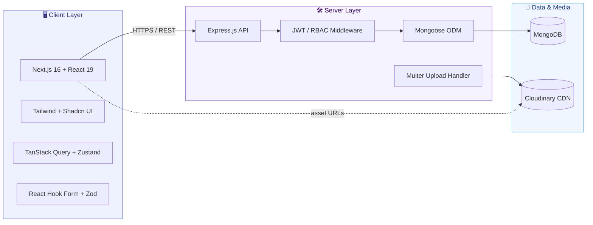

---

# 3. System Architecture

## 3.1 High-Level Layered Architecture

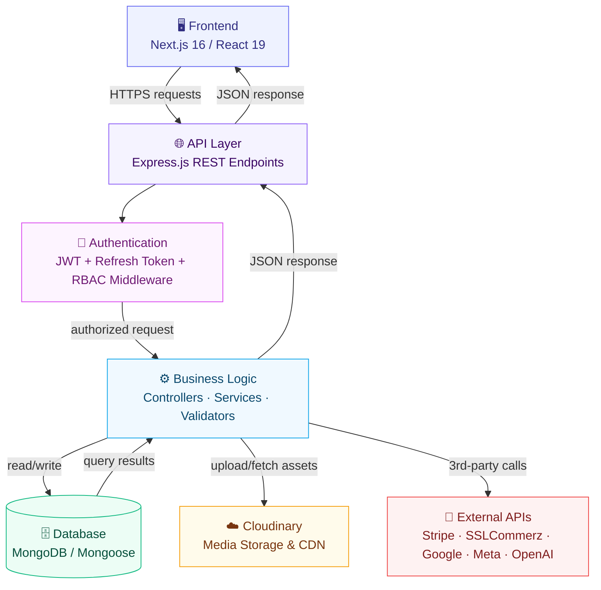

## 3.2 Request Lifecycle (Sequence)

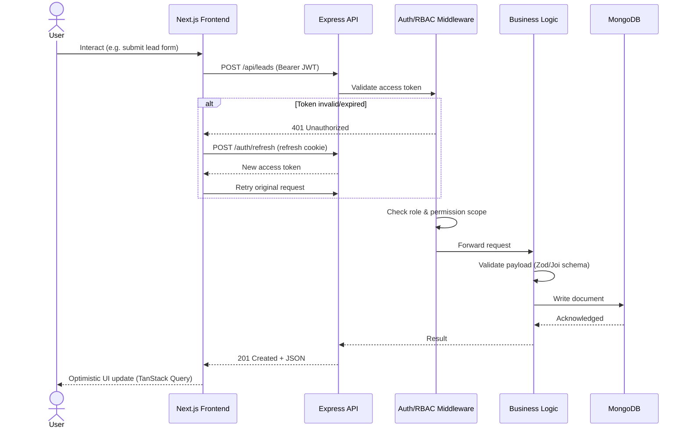

## 3.3 Frontend Architecture

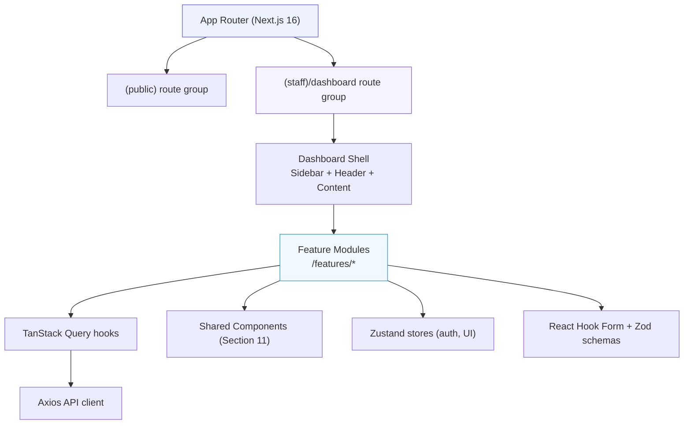

## 3.4 Module Dependency Diagram

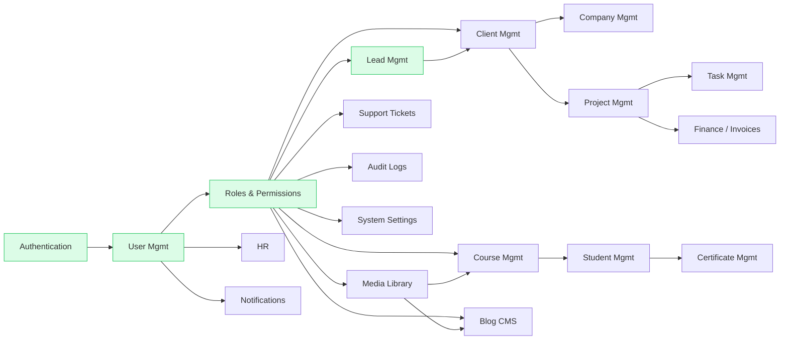

> ⚠️ **Note:** Green nodes above (`Auth`, `Users`, `RBAC`, `Leads`) are the completed foundation everything else is built on top of — see Section 1.5 and Section 16 for live status.

---

# 4. Database Overview

DotSkills Panel uses **MongoDB** with **Mongoose** schemas. Collections are modeled as documents with referenced relationships (`ObjectId` refs) rather than joins, denormalizing read-heavy fields (e.g. `fullName`) where it measurably reduces query fan-out.

## 4.1 Entity Relationship Diagram

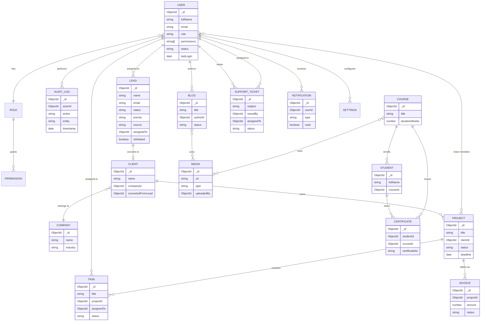

## 4.2 Core Modules & Collections

| # | Module | Primary Collection(s) | Status |
|---|---|---|:---:|
| 1 | Users | `users` | 🟢 Completed |
| 2 | Roles | `roles` (embedded in `users.role` today; normalized in Phase 2) | 🟢 Completed |
| 3 | Permissions | `users.permissions[]` | 🟢 Completed |
| 4 | Leads | `leads`, `lead_notes`, `lead_attachments` | 🟢 Completed |
| 5 | Clients | `clients` | 🔵 Planned |
| 6 | Companies | `companies` | 🔵 Planned |
| 7 | Projects | `projects` | 🔵 Planned |
| 8 | Tasks | `tasks` | 🔵 Planned |
| 9 | Invoices | `invoices` | 🔵 Planned |
| 10 | Courses | `courses`, `course_modules` | 🔵 Planned |
| 11 | Students | `students`, `enrollments` | 🔵 Planned |
| 12 | Certificates | `certificates` | 🔵 Planned |
| 13 | Blogs | `blogs`, `blog_categories` | 🔵 Planned |
| 14 | Media | `media_assets` | 🔵 Planned |
| 15 | Support Tickets | `support_tickets`, `ticket_replies` | 🔵 Planned |
| 16 | Notifications | `notifications` | 🔵 Planned |
| 17 | Audit Logs | `audit_logs` | 🔵 Planned |
| 18 | Settings | `settings` | 🟢 Foundation Completed |

## 4.3 Data Modeling Principles

- **Soft delete by default** — mutable collections (leads, users, clients) carry `isDeleted`, `deletedAt`, `deletedBy` rather than hard-deleting; permanent delete is a separate, permission-gated action.
- **Ownership & audit fields** — `createdBy`, `updatedBy`, `deletedBy`, `createdAt`, `updatedAt` are standard on every collection.
- **Denormalized display fields** — e.g. a `Task` stores `assignedToName` alongside `assignedTo` (ObjectId) to avoid N+1 population on list views; canonical data always lives on the referenced document.
- **Indexes** — compound indexes on `(status, role)`, `(isDeleted, status)`, and text indexes on searchable name/email/title fields.

---

# 5. Authentication Module 🟢

> **Status: 🟢 Completed** — live in production, fully tested.

## 5.1 Overview

The Authentication Module is the security foundation of DotSkills Panel: it verifies identity, issues and rotates tokens, and hands every downstream request a trustworthy user + role context that RBAC middleware relies on.

## 5.2 Features

| Feature | Description | Status |
|---|---|:---:|
| Login | Email + password authentication, returns access token + sets refresh cookie | 🟢 |
| Register | Account creation (admin-invited; public self-register disabled by default) | 🟢 |
| Forgot Password | Requests a reset link/token via email | 🟢 |
| Reset Password | Consumes reset token, sets new password, invalidates old sessions | 🟢 |
| OTP | One-time-passcode step for sensitive actions | 🟢 |
| Email Verification | Confirms ownership of the registered email address | 🟢 |
| JWT Issuance | Short-lived access token (~15 min) signed with server secret | 🟢 |
| RBAC | Role + permission claims embedded in the authorization context | 🟢 |
| Protected Routes | Route-level guards on both frontend (middleware) and backend | 🟢 |
| Role Permissions | Fine-grained per-page permission overrides beyond role defaults | 🟢 |
| Session Management | Refresh-token rotation, forced logout, "sign out everywhere" | 🟢 |

## 5.3 Security Flow Diagram

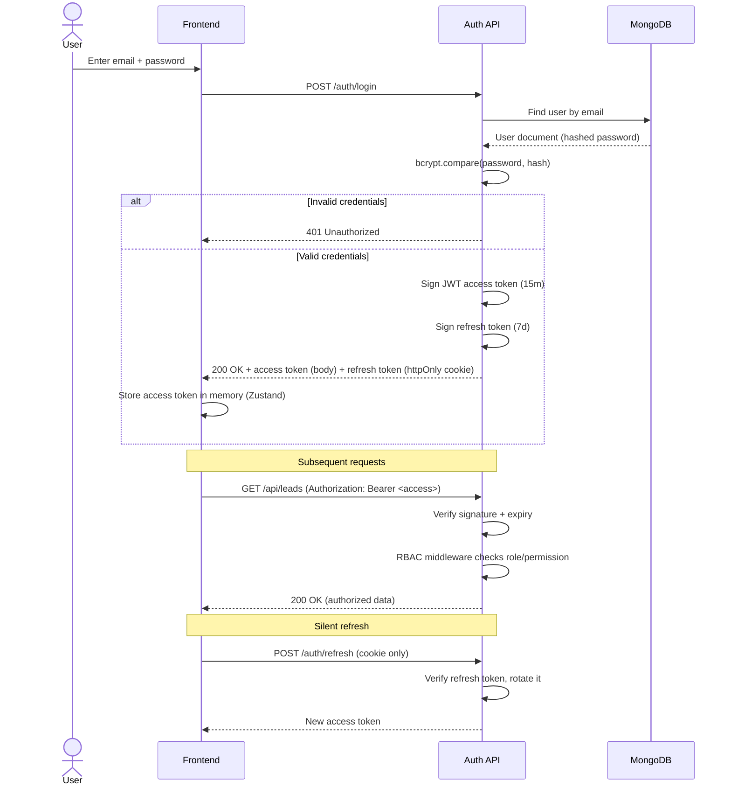

## 5.4 Password & Token Security

- Passwords hashed with **bcrypt** (never stored in plaintext, never returned in API responses — `select: false` on the schema field).
- Access tokens are short-lived and held in memory only (not `localStorage`) to limit XSS exposure.
- Refresh tokens are `httpOnly`, `Secure`, `SameSite=Strict` cookies — inaccessible to client-side JS.
- Refresh tokens rotate on every use; reuse of a revoked refresh token invalidates the whole session family.
- Rate limiting on `/auth/login` and `/auth/forgot-password` to blunt brute-force and enumeration attempts.

## 5.5 RBAC Permission Model

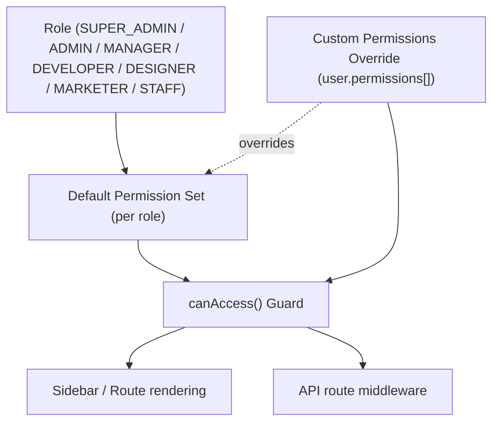

> 💡 **Design note:** `SUPER_ADMIN` always bypasses granular checks (see `canAccess()` in the reference implementation). All other roles resolve to their default permission set unless `user.permissions[]` is explicitly populated, in which case custom permissions take precedence.

---

# 6. User Management Module 🟢

> **Status: 🟢 Completed**

## 6.1 Overview
Central administration surface for every account inside DotSkills Panel — creating staff accounts, assigning roles/permissions, and maintaining profile and status data.

## 6.2 Features

| Feature | Description |
|---|---|
| CRUD | Create, read, update, and (soft) delete user accounts |
| Role Assignment | Assign one of `SUPER_ADMIN / ADMIN / MANAGER / DEVELOPER / DESIGNER / MARKETER / STAFF` |
| Permissions | Optional custom permission overrides per user, beyond role defaults |
| Profile | First/last name, phone, address, bio, designation, department, joining date, reporting manager |
| Password Change | Self-service and admin-forced password reset |
| Avatar | Image upload via Cloudinary, with crop/preview |
| Status | `ACTIVE / INACTIVE / SUSPENDED` lifecycle management |
| Search | Full-text search across name/email/phone |
| Filters | Role, status, department, designation, date-joined range |
| Pagination | Server-side pagination with configurable page size |
| Export | CSV/Excel export of the filtered user list |

## 6.3 Views

- **Table View** — sortable, selectable rows, column visibility toggle, bulk actions.
- **Grid View** — card-based, role-color-coded, quick-scan layout.
- **Details Panel** — slide-over showing full profile, contact info, work details, access & permissions, and activity timestamps (last login, created, updated).

## 6.4 Workflow — Create & Onboard a User

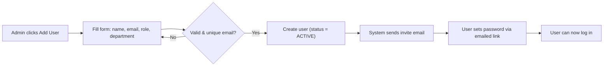

## 6.5 Validation Rules

| Field | Rule |
|---|---|
| `email` | Required, unique, valid email format |
| `firstName` / `lastName` | 2–50 characters |
| `role` | Required, must be one of the defined `Role` enum values |
| `phone` | Optional, format-validated |
| `bio` | Max 500 characters |

## 6.6 Permissions Matrix

| Action | Super Admin | Admin | Manager | Staff |
|---|:---:|:---:|:---:|:---:|
| View users | ✅ | ✅ | ✅ (team only) | ❌ |
| Create user | ✅ | ✅ | ❌ | ❌ |
| Edit any user | ✅ | ✅ | ❌ | ❌ |
| Edit own profile | ✅ | ✅ | ✅ | ✅ |
| Change role | ✅ | ✅ | ❌ | ❌ |
| Delete user | ✅ | ✅ | ❌ | ❌ |
| Assign custom permissions | ✅ | ✅ | ❌ | ❌ |

## 6.7 Future Scope

- Bulk role/permission editing.
- Org chart visualization driven by `reportingManager`.
- SSO (Google Workspace / Microsoft 365) — see Section 14.

---

# 7. Lead Management Module 🟢

> **Status: 🟢 Completed** — the primary sales-pipeline entry point feeding Client Management (Phase 2).

## 7.1 Overview
Lead Management is the system's sales front line: every prospect — however they arrive (web form, cold outreach, referral, ad campaign) — is captured, qualified, worked, and either converted into a Client or marked lost, with a complete timeline of everything that happened along the way.

## 7.2 Feature Catalogue

| Feature | Description |
|---|---|
| Create Lead | Manual entry or auto-capture from public site forms |
| Edit Lead | Update any field; changes are timeline-logged |
| Delete (Soft) | Moves lead to a recoverable trash state |
| Restore | Reinstates a soft-deleted lead |
| Permanent Delete | Irreversible removal (Admin/Super Admin only) |
| Import CSV / Import Excel | Bulk-load leads with column mapping + duplicate detection |
| Export CSV | Export the current filtered view |
| Lead Assignment | Assign to a staff member; reassignment is timeline-logged |
| Lead Conversion | One-click conversion into a Client record (Section 10.1), preserving history |
| Lead Status | `New → Contacted → In Progress → Qualified → Converted / Lost` |
| Lead Priority | `Low / Medium / High` |
| Lead Source | `Website / Referral / Cold Call / Email Campaign / LinkedIn / Advertisement / Other` |
| Notes | Threaded, timestamped notes per lead |
| Attachments | File uploads (proposals, call recordings) via Cloudinary |
| Search | Search by name, email, phone |
| Advanced Filters | Status, priority, source, assigned-to, date range (compound filtering) |
| Pagination | Server-side, with adjustable page size |
| Sorting | Any sortable column, asc/desc |
| Column Visibility | Per-user persisted column preferences |
| Bulk Actions | Bulk assign, bulk status change, bulk delete/export |
| Lead Timeline | Full audit trail: creation, edits, status changes, notes, assignment history |
| RBAC Permissions | Field- and action-level gating (Section 7.6) |
| Activity Tracking | "Last contacted," "days since last activity" surfaced in the UI |

## 7.3 Lead Lifecycle / Workflow Diagram

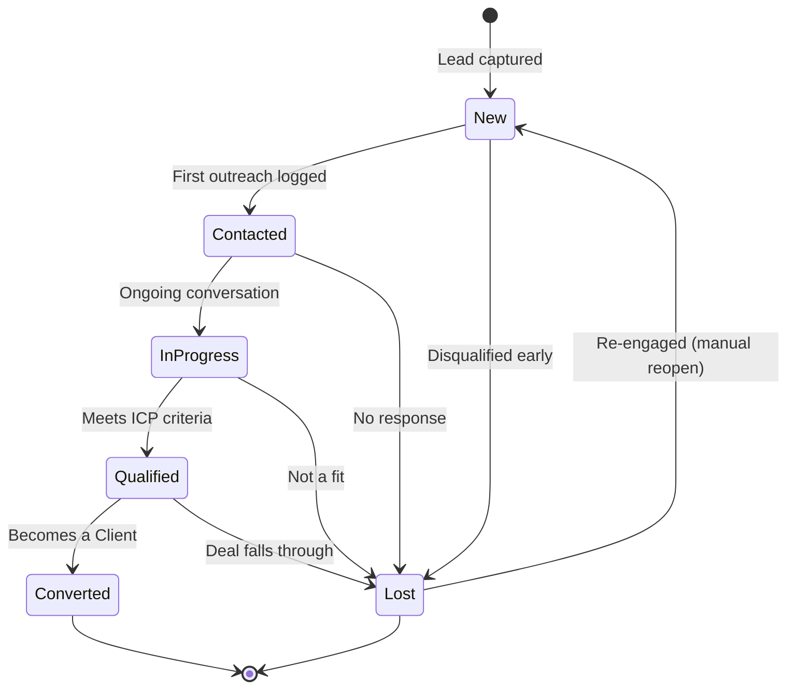

## 7.4 Import Flow

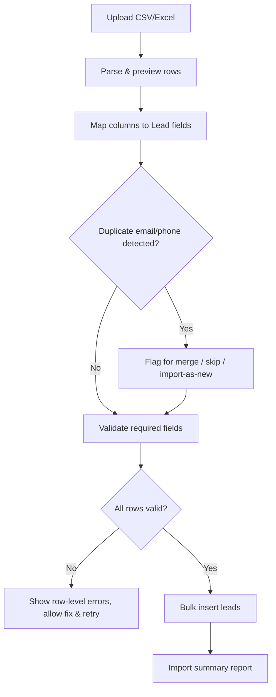

## 7.5 Field Reference

| Field | Type | Notes |
|---|---|---|
| `name` | string | Required |
| `email` | string | Optional but recommended; validated format |
| `phone` | string | Optional |
| `status` | enum | See lifecycle above |
| `priority` | enum | `LOW / MEDIUM / HIGH` |
| `source` | enum | See source list above |
| `assignedTo` | ObjectId ref → User | Nullable (unassigned) |
| `estimatedValue` | number | Optional deal-size estimate |
| `isDeleted` | boolean | Soft-delete flag |
| `notes[]` | subdocument[] | `{ authorId, text, createdAt }` |
| `attachments[]` | subdocument[] | `{ url, fileName, uploadedBy, uploadedAt }` |

## 7.6 RBAC Permissions Matrix

| Action | Super Admin | Admin | Manager | Marketer | Staff (assigned only) |
|---|:---:|:---:|:---:|:---:|:---:|
| View all leads | ✅ | ✅ | ✅ | ✅ | ❌ |
| View assigned leads | ✅ | ✅ | ✅ | ✅ | ✅ |
| Create lead | ✅ | ✅ | ✅ | ✅ | ❌ |
| Edit lead | ✅ | ✅ | ✅ | ✅ (own) | ✅ (assigned) |
| Assign/reassign | ✅ | ✅ | ✅ | ❌ | ❌ |
| Soft delete | ✅ | ✅ | ✅ | ❌ | ❌ |
| Restore | ✅ | ✅ | ✅ | ❌ | ❌ |
| Permanent delete | ✅ | ✅ | ❌ | ❌ | ❌ |
| Import/Export | ✅ | ✅ | ✅ | ✅ | ❌ |
| Convert to Client | ✅ | ✅ | ✅ | ❌ | ❌ |

## 7.7 Future Scope

- AI Lead Scoring (Section 13).
- Automated email sequences on status change.
- Two-way sync with Meta Lead Ads (Section 14).

---

# 8. Dashboard

## 8.1 Completed Base 🟢

| Component | Description |
|---|---|
| Dashboard Shell | Sidebar + sticky header + independently-scrolling content region |
| Sidebar Navigation | Collapsible, permission-filtered, grouped navigation (Section 3.3) |
| Header | Breadcrumbs, search entry point, user menu, theme toggle |
| Route Guarding | Every dashboard route checks role/permission before render |
| Responsive Shell | Mobile drawer sidebar, adaptive header |

## 8.2 Remaining Scope 🔵

| Feature | Description | Depends On |
|---|---|---|
| Analytics Widgets | Lead funnel, conversion rate, revenue-to-date | Leads ✅, Finance 🔵 |
| Revenue Summary | MTD/QTD/YTD revenue cards with trend deltas | Finance 🔵 |
| Notifications Center | In-app + badge-counted notification feed | Notifications 🔵 |
| Charts | Recharts-based trend lines, bar comparisons, funnel visuals | — |
| Widgets | Configurable widget grid (drag-to-rearrange, future) | — |
| Recent Activities | Cross-module activity feed (leads, tasks, tickets) | Audit Logs 🔵 |
| Quick Actions | "New Lead," "New Task," "New Invoice" shortcuts from the header | Respective modules |

## 8.3 Dashboard Data Flow

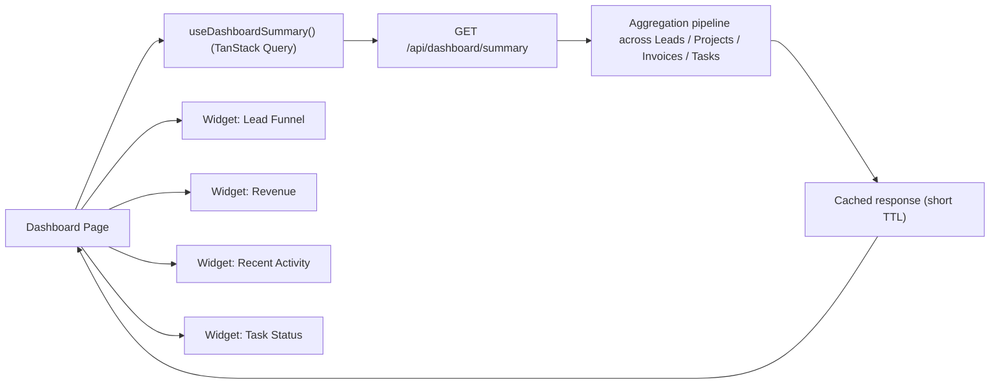

---

# 9. Public Website Documentation

> Each page below follows the same nine-part template so QA, SEO, and design can review consistently.

## 9.1 Home

| | |
|---|---|
| **Purpose** | First-impression landing page; communicate what DotSkills does and route visitors to Services, Courses, or Contact. |
| **Target Users** | Prospective clients, prospective students, partners |
| **UI Sections** | Hero + CTA · Services overview grid · Featured projects · Testimonials · Course highlights · Blog preview · CTA banner · Footer |
| **Functional Requirements** | Newsletter signup; CTA buttons route to `/contact` and `/services`; testimonial carousel; lazy-loaded below-fold sections |
| **Future Improvements** | Personalized hero based on UTM/referrer; A/B-testable CTA copy |
| **SEO Requirements** | Unique `<title>`/meta description; JSON-LD `Organization` schema; canonical tag; OG/Twitter cards |
| **Performance Requirements** | LCP < 2.5s; hero image served via Cloudinary responsive `srcset` |
| **Accessibility Requirements** | WCAG 2.1 AA; skip-to-content link; carousel keyboard-navigable |
| **Responsive Requirements** | Mobile-first; hero collapses to single column < 768px |

## 9.2 About

| | |
|---|---|
| **Purpose** | Build trust — company story, mission, team, values |
| **Target Users** | Prospective clients, candidates, partners |
| **UI Sections** | Mission/vision · Timeline of company milestones · Team grid · Values cards · Office/culture gallery |
| **Functional Requirements** | Team data pulled from CMS (avoid hardcoding); milestone timeline component |
| **Future Improvements** | Video culture reel; press/media mentions section |
| **SEO Requirements** | `AboutPage` schema; internal links to Careers and Services |
| **Performance Requirements** | Team photos served as WebP/AVIF via Cloudinary |
| **Accessibility Requirements** | Alt text mandatory on all team photos; timeline navigable without a mouse |
| **Responsive Requirements** | Team grid reflows 4→2→1 columns |

## 9.3 Services

| | |
|---|---|
| **Purpose** | Showcase service lines and drive qualified inquiries |
| **Target Users** | Prospective clients evaluating vendors |
| **UI Sections** | Service category tabs · Per-service detail cards · Process/methodology diagram · Related case studies · CTA |
| **Functional Requirements** | Service data CMS-driven; deep-linkable per-service anchors (`/services#web-development`) |
| **Future Improvements** | Interactive pricing/estimate calculator |
| **SEO Requirements** | `Service` schema per offering; keyword-targeted per-service copy |
| **Performance Requirements** | Tab content code-split, not all loaded upfront |
| **Accessibility Requirements** | Tabs implement ARIA `tablist`/`tab`/`tabpanel` roles |
| **Responsive Requirements** | Tabs collapse to accordion on mobile |

## 9.4 Courses

| | |
|---|---|
| **Purpose** | Public catalog of DotSkills' educational offerings; drives enrollment leads |
| **Target Users** | Prospective students |
| **UI Sections** | Course catalog grid with filters (category, level, duration) · Course detail page (curriculum, instructor, pricing) · Enrollment CTA |
| **Functional Requirements** | Filter/search catalog; enrollment form creates a Lead (source = "Course Enrollment") |
| **Future Improvements** | Student reviews/ratings; syllabus PDF download |
| **SEO Requirements** | `Course` schema (schema.org); per-course canonical URLs |
| **Performance Requirements** | Catalog paginated/virtualized for large course counts |
| **Accessibility Requirements** | Filter controls fully keyboard-operable and screen-reader labeled |
| **Responsive Requirements** | Grid 3→2→1 columns; sticky filter bar collapses to drawer on mobile |

## 9.5 Projects

| | |
|---|---|
| **Purpose** | Portfolio / case-study proof of delivery capability |
| **Target Users** | Prospective clients doing vendor evaluation |
| **UI Sections** | Filterable project grid (by service type/industry) · Case study detail (challenge/solution/results) |
| **Functional Requirements** | Project data CMS-driven; image gallery with lightbox |
| **Future Improvements** | Client-permissioned metrics ("30% conversion lift") with verified badges |
| **SEO Requirements** | `CreativeWork`/`Article`-style schema per case study |
| **Performance Requirements** | Gallery images lazy-loaded, Cloudinary-optimized |
| **Accessibility Requirements** | Lightbox trap-focus + Escape-to-close |
| **Responsive Requirements** | Masonry/grid degrades gracefully to single column |

## 9.6 Blog

| | |
|---|---|
| **Purpose** | Content marketing, SEO traffic, thought leadership |
| **Target Users** | Prospects researching, existing clients, general public |
| **UI Sections** | Category/tag filters · Article list with pagination · Article detail (rich text, TOC, related posts) · Newsletter CTA |
| **Functional Requirements** | Powered by Blog CMS (Section 10.11); comments deferred to future scope; reading-time estimate |
| **Future Improvements** | Author profile pages; content recommendations (AI Blog Writer synergy, Section 13) |
| **SEO Requirements** | `Article`/`BlogPosting` schema; sitemap auto-updates on publish |
| **Performance Requirements** | Article images responsive; ISR (Incremental Static Regeneration) for published posts |
| **Accessibility Requirements** | Proper heading hierarchy in rich-text content; readable line length |
| **Responsive Requirements** | TOC collapses to a top drawer on mobile |

## 9.7 Career

| | |
|---|---|
| **Purpose** | List open roles and accept applications |
| **Target Users** | Job candidates |
| **UI Sections** | Open positions list (filter by department/location) · Job detail page · Application form (resume upload) |
| **Functional Requirements** | Resume upload via Cloudinary; application creates a record reviewable in a future HR module (Section 10.7) |
| **Future Improvements** | Candidate portal with application status tracking |
| **SEO Requirements** | `JobPosting` schema (required for Google Jobs indexing) |
| **Performance Requirements** | Resume upload with client-side file-size validation before submit |
| **Accessibility Requirements** | Form fully labeled; file upload has an accessible fallback |
| **Responsive Requirements** | Application form single-column on all breakpoints |

## 9.8 Contact

| | |
|---|---|
| **Purpose** | Primary conversion point — every submission becomes a Lead |
| **Target Users** | All visitor types |
| **UI Sections** | Contact form · Office location/map · Direct contact details · Social links |
| **Functional Requirements** | Form submit → creates Lead (source = "Website"); spam protection (honeypot/CAPTCHA); confirmation email |
| **Future Improvements** | Live chat widget integration |
| **SEO Requirements** | `LocalBusiness`/`ContactPage` schema |
| **Performance Requirements** | Map lazy-loaded on scroll-into-view |
| **Accessibility Requirements** | Form errors announced via `aria-live` |
| **Responsive Requirements** | Map/form stack vertically < 900px |

## 9.9 FAQ

| | |
|---|---|
| **Purpose** | Reduce support/sales friction by answering common questions |
| **Target Users** | Prospects and students pre-purchase |
| **UI Sections** | Categorized accordion list · Search-within-FAQ |
| **Functional Requirements** | Accordion expand/collapse; deep-linkable questions |
| **Future Improvements** | AI Chatbot surfaces FAQ answers directly (Section 13) |
| **SEO Requirements** | `FAQPage` schema for rich-result eligibility |
| **Performance Requirements** | Content statically generated |
| **Accessibility Requirements** | Accordion uses `aria-expanded`/`aria-controls` |
| **Responsive Requirements** | Full-width single column at all sizes |

## 9.10 Privacy Policy

| | |
|---|---|
| **Purpose** | Legal disclosure of data collection/use practices |
| **Target Users** | All visitors; legal/compliance reviewers |
| **UI Sections** | Static long-form legal content with anchor-linked TOC |
| **Functional Requirements** | Versioned content with "last updated" date |
| **Future Improvements** | Localized versions per region |
| **SEO Requirements** | `noindex` optional per legal preference; low priority in sitemap |
| **Performance Requirements** | Static generation; no client JS required beyond TOC scroll-spy |
| **Accessibility Requirements** | Semantic heading structure for screen-reader navigation |
| **Responsive Requirements** | Readable line-length maintained via `max-w` container |

## 9.11 Terms of Service

*(Same structural template as 9.10 — Purpose: contractual terms of platform/service use; reviewed by legal counsel prior to publish.)*

## 9.12 Cookie Policy

*(Same structural template as 9.10 — Purpose: disclose cookie usage; paired with a cookie-consent banner that writes user choice to a first-party cookie and gates non-essential analytics scripts until consent is given.)*

---

# 10. Dashboard Modules

> 🔵 All modules in this section are **Planned** per the roadmap (Section 15) unless explicitly marked otherwise. Each follows the same eight-part template: Overview → Business Purpose → Features → CRUD Operations → Workflow → Validation → Permissions → Future Scope.

## 10.1 Client Management

**Overview.** The system of record for every organization or individual DotSkills has an active or past commercial relationship with — the destination for converted Leads.

**Business Purpose.** Give account owners a single view of relationship history, active projects, and billing status per client.

**Features.** Client profile · linked Company · contact persons · linked projects & invoices · relationship timeline · tags/segments.

**CRUD Operations.**

| Operation | Notes |
|---|---|
| Create | Manual, or automatic on Lead conversion |
| Read | Detail view aggregates linked Projects, Invoices, Tasks |
| Update | Profile, contacts, segment tags |
| Delete | Soft delete; blocked if active Projects exist |

**Workflow.** `Lead Qualified → Convert → Client Created → Company Linked/Created → Project Kickoff`

**Validation.** Primary contact email required; company link optional but recommended; duplicate-client detection on name+domain.

**Permissions.** Admin/Manager: full CRUD. Staff: read-only on assigned clients.

**Future Scope.** Client self-service portal; satisfaction (NPS) surveys.

## 10.2 Company Management

**Overview.** Organizational parent entity that groups one or more Client contacts.

**Business Purpose.** Correctly model B2B relationships where multiple stakeholders (Clients) belong to one Company, enabling account-level reporting.

**Features.** Company profile (industry, size, website) · linked clients · linked projects (roll-up) · notes.

**CRUD Operations.** Standard CRUD; delete blocked if linked Clients exist (must reassign/delete children first).

**Workflow.** `Company created (manually or via Client conversion) → Clients linked → Account-level reporting available`

**Validation.** Company name required and unique per normalized domain.

**Permissions.** Same tier as Client Management.

**Future Scope.** Firmographic auto-enrichment via a data provider API.

## 10.3 Project Management

**Overview.** Tracks delivery work for a Client from kickoff to close.

**Business Purpose.** Give delivery leads and clients visibility into scope, timeline, and progress; the parent container for Tasks and Invoices.

**Features.** Project profile (scope, deadline, budget) · status board · team assignment · linked tasks · linked invoices · file attachments · progress %.

**CRUD Operations.** Standard CRUD; archiving replaces hard delete for completed projects.

**Workflow Diagram.**

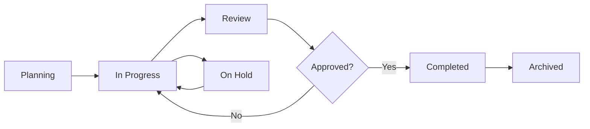

**Validation.** Deadline must be ≥ start date; budget must be ≥ sum of linked invoice line items (warning, not hard block).

**Permissions.** Manager: full CRUD + team assignment. Developer/Designer: read + task-level updates on assigned projects.

**Future Scope.** Gantt/timeline view; resource-capacity planning.

## 10.4 Task Management

**Overview.** Granular units of work belonging to a Project (or standalone/personal tasks).

**Business Purpose.** Translate project scope into assignable, trackable work items — the day-to-day unit staff interact with.

**Features.** Kanban board + list view · priority · due date · subtasks/checklist · comments · file attachments · time tracking (future) · dependencies.

**CRUD Operations.** Standard CRUD; drag-and-drop status change (Kanban) counts as an Update.

**Workflow.** `To Do → In Progress → In Review → Done` (configurable per project board)

**Validation.** Title required; due date cannot precede project start date; status transitions follow the board's configured column order.

**Permissions.** Assignee: update own task status/comments. Manager: full CRUD across the project's tasks.

**Future Scope.** Built-in time tracking with timesheet roll-up into Finance.

## 10.5 Calendar

**Overview.** Unified calendar surfacing task due dates, project milestones, meetings, and (future) HR leave.

**Business Purpose.** One place to see "what's due when" without cross-referencing every module.

**Features.** Month/week/day views · color-coded by module source · click-through to source record · manual event creation.

**CRUD Operations.** Manual events support full CRUD; module-sourced events (tasks, milestones) are read-only here (edit at source).

**Workflow.** `Source record created/updated (Task due date, Project milestone) → Calendar auto-reflects → User clicks event → Deep-links to source`

**Validation.** Manual events require title + start time; end time must be ≥ start time.

**Permissions.** Personal calendar visible to self; Manager can view team calendars; Admin sees org-wide.

**Future Scope.** Google Calendar / Microsoft 365 two-way sync (Section 14).

## 10.6 Finance

**Overview.** Invoicing, payments, and revenue tracking tied to Projects/Clients.

**Business Purpose.** Turn delivered work into billed, collected revenue with clear status visibility.

**Features.** Invoice generation (from Project scope or manual line items) · payment status tracking · payment gateway integration (Stripe/SSLCommerz/PayPal) · revenue reports · expense tracking (future).

**CRUD Operations.** Standard CRUD on invoices; payments are append-only (immutable ledger entries) rather than editable.

**Workflow Diagram.**

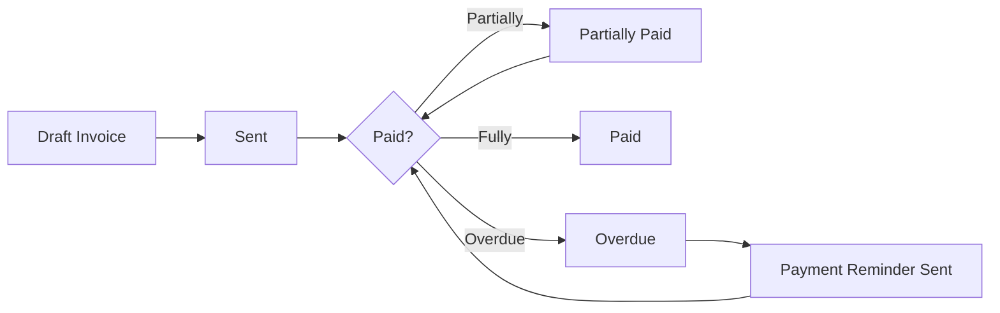

**Validation.** Line-item totals must equal invoice total; currency locked at creation; cannot delete an invoice with recorded payments (must void/credit-note instead).

**Permissions.** Admin/Finance role: full access. Manager: read + create draft. Staff: no access.

**Future Scope.** Recurring/subscription billing; multi-currency; expense & profitability reporting.

## 10.7 HR

**Overview.** Employee lifecycle data — attendance, leave, and (future) payroll.

**Business Purpose.** Bring people-operations data into the same permissioned system as everything else, instead of a separate spreadsheet.

**Features.** Attendance check-in/out · leave request & approval · leave balance tracking · employee documents.

**CRUD Operations.** Leave requests: Create (staff) → Read/Update status (manager approval) → soft-cancel.

**Workflow.** `Staff submits leave request → Manager notified → Approve/Reject → Leave balance updated → Calendar reflects approved leave`

**Validation.** Leave dates cannot overlap an existing approved leave; requested days cannot exceed available balance (soft warning, override allowed for Admin).

**Permissions.** Staff: self-service only. Manager: approve/reject for direct reports. Admin: org-wide.

**Future Scope.** Payroll integration; performance review cycles.

---

## 10.8 Course Management

**Overview.** Catalog and curriculum management for DotSkills' education offerings — the CMS backing the public Courses page (9.4).

**Business Purpose.** Let the education team publish/update course offerings without engineering involvement, and feed Student enrollment and Certificate issuance.

**Features.** Course profile (title, description, curriculum modules, duration, price) · instructor assignment · publish/unpublish · enrollment capacity · prerequisite courses.

**CRUD Operations.** Standard CRUD; unpublish instead of delete once a course has enrollments.

**Workflow.** `Draft → Internal Review → Published (visible on public site) → Enrollment Open → Enrollment Closed → Archived`

**Validation.** Title + at least one curriculum module required before publish; price ≥ 0.

**Permissions.** Admin/Manager (education): full CRUD + publish. Marketer: read + draft edit.

**Future Scope.** AI Course Generator assist (Section 13); cohort scheduling.

## 10.9 Student Management

**Overview.** Enrollment records linking a person to one or more Courses.

**Business Purpose.** Track who's enrolled in what, their progress, and their eligibility for certification.

**Features.** Student profile · enrollment history · progress tracking · payment status (links to Finance) · communication log.

**CRUD Operations.** Standard CRUD; enrollment is a subdocument/linking action rather than a top-level create.

**Workflow.** `Public enrollment form (or admin-created) → Student record created → Enrolled in Course → Progress tracked → Course completed → Eligible for Certificate`

**Validation.** Email required and used as the dedup key across enrollments; cannot enroll twice in the same course concurrently.

**Permissions.** Admin/Manager (education): full CRUD. Instructor: read + progress update on their courses.

**Future Scope.** Student self-service portal (login, progress view, certificate download).

## 10.10 Certificate Management

**Overview.** Generates and tracks completion certificates tied to a Student + Course pair.

**Business Purpose.** Provide verifiable proof of course completion, with a lookup mechanism for authenticity checks.

**Features.** Auto-generated certificate number · PDF generation (templated) · public verification lookup page · re-issue/revoke.

**CRUD Operations.** Create on course completion (manual trigger or automated); Update limited to revoke/re-issue; no hard delete (audit integrity).

**Workflow.** `Student marked "Completed" → Eligibility check → Certificate generated (PDF, unique number) → Emailed to student → Publicly verifiable via /verify/:certNo`

**Validation.** Student must have `status = COMPLETED` on the linked enrollment before generation is allowed.

**Permissions.** Admin/Manager (education): generate/revoke. All other roles: read-only via public verification page (no auth required).

**Future Scope.** Blockchain-anchored verification; LinkedIn "Add to Profile" integration.

## 10.11 Blog CMS

**Overview.** Content management system powering the public Blog (9.6).

**Business Purpose.** Enable Marketing to publish SEO content independently, with editorial workflow (draft → review → publish).

**Features.** Rich text editor (Section 11) · categories/tags · featured image (Media Library) · SEO meta fields · scheduled publishing · draft/preview.

**CRUD Operations.** Standard CRUD; scheduled posts auto-publish via a cron/queue job at the configured time.

**Workflow.** `Draft → Internal Review → Approved → Published (immediate or scheduled) → Indexed (sitemap regenerated)`

**Validation.** Title + slug required, slug uniqueness enforced; meta description length-checked (SEO best practice, soft warning).

**Permissions.** Marketer: create/edit own drafts. Manager/Admin: approve + publish.

**Future Scope.** AI Blog Writer assist (Section 13); commenting system.

## 10.12 Media Library

**Overview.** Centralized asset manager for images/files used across Blog, Courses, and Projects — backed by Cloudinary.

**Business Purpose.** Prevent duplicate uploads and give a single searchable place to manage all media assets and their usage.

**Features.** Grid/list browser · folder/tag organization · usage tracking ("used in 3 blog posts") · drag-and-drop upload · image transformations (crop/resize preview) · bulk delete.

**CRUD Operations.** Create (upload) · Read (browse/search) · Update (rename, re-tag) · Delete (blocked if asset is currently referenced, unless forced).

**Workflow.** `Upload (Multer → Cloudinary) → Thumbnail generated → Asset indexed with metadata → Available for selection in Blog/Course/Project editors`

**Validation.** File type allow-list (image/pdf/doc types); max file size enforced client- and server-side.

**Permissions.** Any staff role with module access can upload; delete restricted to Admin/Manager or the original uploader.

**Future Scope.** AI-assisted alt-text generation; automatic image optimization presets.

## 10.13 Support Ticket System

**Overview.** Internal/external issue-tracking for support requests.

**Business Purpose.** Ensure client and internal support requests are tracked to resolution with SLA visibility, instead of living in email threads.

**Features.** Ticket creation (public form or internal) · priority/SLA · assignment · threaded replies · status tracking · attachments · satisfaction rating (future).

**CRUD Operations.** Standard CRUD on tickets; replies are append-only.

**Workflow Diagram.**

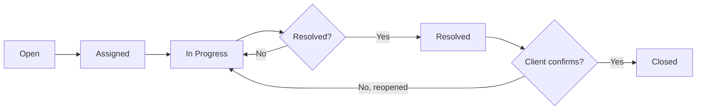

**Validation.** Subject + description required; priority defaults to Medium if unset.

**Permissions.** Raiser: view/comment on own tickets. Assignee/Manager: full ticket management.

**Future Scope.** SLA breach alerts; AI Chatbot first-line triage (Section 13).

## 10.14 Notifications

**Overview.** Cross-module, real-time-ish notification system (in-app + email digest).

**Business Purpose.** Keep users informed of relevant events (assignment, mention, status change) without requiring them to poll every module.

**Features.** In-app notification bell with unread badge · per-type read/unread state · notification preferences (email vs. in-app per event type) · mark-all-read.

**CRUD Operations.** System-generated create (event-driven); Read/Update limited to read-state toggling by the recipient; no user-facing delete (auto-archived after retention window).

**Workflow.** `Event occurs (e.g. Task assigned) → Notification service creates Notification doc → Pushed to recipient (in-app + optional email) → User reads → Marked read`

**Validation.** Every notification requires `userId`, `type`, and `message`; type must map to a known notification template.

**Permissions.** Users only see their own notifications; Admin can view org-wide notification logs for support purposes.

**Future Scope.** WebSocket/real-time push; Slack/Discord delivery channel (Section 14).

## 10.15 Reports

**Overview.** Cross-module analytical reporting surface (leads, sales, project delivery, finance).

**Business Purpose.** Give managers and leadership data-driven visibility without needing to export raw data to a spreadsheet.

**Features.** Pre-built report templates (Lead Conversion, Revenue, Task Throughput) · date-range filtering · export to PDF/Excel · scheduled email reports (future).

**CRUD Operations.** Reports are generated (read-only, computed), not stored as editable entities; saved report *configurations* support CRUD.

**Workflow.** `Select report template → Apply filters (date range, team, module) → Aggregation query runs → Rendered chart/table → Export or save configuration`

**Validation.** Date range required; end date must be ≥ start date.

**Permissions.** Manager: team-scoped reports. Admin/Super Admin: org-wide reports.

**Future Scope.** Custom report builder (drag-and-drop metrics); AI Analytics narrative summaries (Section 13).

## 10.16 Audit Logs

**Overview.** Immutable record of sensitive actions across the platform — who did what, when.

**Business Purpose.** Accountability and forensic traceability; required for enterprise/compliance-minded clients.

**Features.** Filterable log viewer (actor, action type, entity, date range) · action detail diff (before/after) · export.

**CRUD Operations.** Create-only from the application's perspective (system-generated on every sensitive mutation); logs are never editable or user-deletable.

**Workflow.** `Sensitive action performed (e.g. role changed, lead permanently deleted) → Middleware writes AuditLog entry → Queryable in Audit Log viewer`

**Validation.** Every entry requires `actorId`, `action`, `entity`, `entityId`, `timestamp`.

**Permissions.** Admin/Super Admin only.

**Future Scope.** Anomaly detection alerts (e.g. unusual bulk-delete activity).

## 10.17 System Settings

**Overview.** 🟢 *Foundation completed* — org-wide configuration surface.

**Business Purpose.** Centralize configuration (branding, notification defaults, integration keys) instead of scattering it across environment variables and code.

**Features.** General settings (org name, logo, timezone) · notification defaults · integration credential management (Section 14) · role/permission defaults editor.

**CRUD Operations.** Effectively a singleton-per-tenant Update operation; sensitive fields (API keys) are write-only in the UI (masked on read).

**Workflow.** `Admin updates a setting → Validated → Persisted → Cache invalidated → Reflected app-wide on next load`

**Validation.** Integration credentials validated via a test-connection call before save where feasible.

**Permissions.** Super Admin/Admin only.

**Future Scope.** Multi-tenant/white-label settings if DotSkills Panel is offered to external orgs.

## 10.18 Profile

**Overview.** Self-service account page for the logged-in user.

**Business Purpose.** Let every user manage their own identity, credentials, and preferences without admin involvement.

**Features.** Edit personal info · change password · upload avatar · notification preferences · theme preference · active-session list with "sign out" per session.

**CRUD Operations.** Update-only against the current user's own document; no create/delete (that's User Management's domain).

**Workflow.** `User opens Profile → Edits field → Save → Optimistic UI update (TanStack Query mutation) → Confirmation toast`

**Validation.** Same field-level rules as User Management (Section 6.5), scoped to self.

**Permissions.** Every authenticated user can access their own Profile; cannot edit `role`/`permissions` here (Admin-only, in User Management).

**Future Scope.** Two-factor authentication enrollment; connected-account management (Google/Microsoft SSO).

---

# 11. Shared Components

> The reusable component library every module composes from — built once, styled consistently, used everywhere.

| Component | Purpose |
|---|---|
| **Data Table** | Sortable, filterable, paginated table (TanStack Table) with column visibility & row selection |
| **Search** | Debounced search input, consistent across all list views |
| **Pagination** | Server-side pagination control (page size, jump-to-page) |
| **Filters** | Composable filter bar (dropdowns, date-range, multi-select) |
| **Dialogs** | Modal (create/edit forms) and Sheet (slide-over detail panels) |
| **Upload** | Drag-and-drop file upload with progress, backed by Cloudinary |
| **Skeleton** | Loading placeholders matching final content shape |
| **Theme** | Light/dark mode toggle and provider |
| **Breadcrumb** | Dynamic, route-driven breadcrumb trail (Section 3.3) |
| **Command Palette** | ⌘K global search/navigation |
| **Rich Text Editor** | WYSIWYG editor for Blog/Course content, with image embed via Media Library |
| **Empty State** | Consistent "nothing here yet" illustration + CTA across every list view |
| **Error State** | Consistent error boundary/fallback UI with retry action |
| **Loading State** | Standardized spinner/skeleton pattern for async boundaries |

# 12. Shared Utilities

| Utility | Purpose |
|---|---|
| **Axios instance** | Centralized API client — base URL, auth header injection, refresh-on-401 interceptor |
| **TanStack Query setup** | Global query client config (stale time, retry policy, cache invalidation conventions) |
| **Zustand stores** | Auth/session store, UI preference store (sidebar collapsed, theme) |
| **RBAC helpers** | `hasPermission`, `hasAnyPermission`, `hasAllPermissions`, `canAccess`, `isSuperAdmin` (Section 5.5) |
| **Validation (Zod schemas)** | Shared schemas between React Hook Form and API request typing |
| **Export helpers** | CSV/Excel export utilities used by Users, Leads, Reports |
| **Date helpers** | Formatting, relative time ("2 days ago"), timezone-safe range calculations |
| **Cloudinary upload helper** | Signed-upload wrapper used by Avatar, Media Library, Attachments |
| **Table helpers** | Column-definition factories, shared cell renderers (badges, avatars) reused across modules |

---

# 13. AI Roadmap (Future)

> ⚪ **Status: Future** — sequenced after Phase 4 (Section 15). Listed here to ensure the data model (Section 4) doesn't need to be reshaped to accommodate them later.

| # | Feature | Description | Builds On |
|---|---|---|---|
| 1 | 🤖 AI CRM Assistant | Natural-language querying of CRM data ("show me leads that went cold this week") | Leads, Clients |
| 2 | 📝 AI Proposal Generator | Drafts client proposals from project scope + past proposal patterns | Projects, Clients |
| 3 | 📧 AI Email Generator | Suggests follow-up email copy for leads/clients based on context | Leads, Notes |
| 4 | 📊 AI Analytics | Narrative summaries over Reports data ("revenue is up 12% MoM, driven by...") | Reports, Finance |
| 5 | ✍️ AI Blog Writer | Drafts/expands blog content from an outline; Marketer edits & publishes | Blog CMS |
| 6 | 💬 AI Chatbot | Public-site + support-ticket first-line assistant, FAQ-aware | FAQ, Support Tickets |
| 7 | 🎓 AI Course Generator | Assists curriculum drafting from a topic/outline | Course Management |
| 8 | 🗒️ AI Meeting Summary | Summarizes meeting transcripts into action items/tasks | Calendar, Tasks |
| 9 | 🎯 AI Lead Scoring | Predictive scoring of lead quality/conversion likelihood | Leads |
| 10 | 📄 Document AI | Extracts structured data from uploaded documents (contracts, resumes) | Media Library, Career |

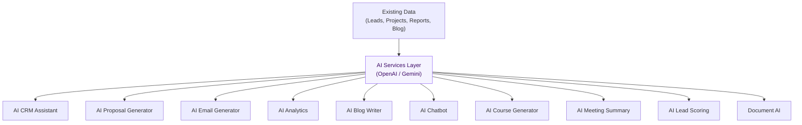

---

# 14. Integrations

| Integration | Category | Purpose | Status |
|---|---|---|:---:|
| **Google Workspace** | Productivity | Calendar sync, SSO | ⚪ Future |
| **Microsoft 365** | Productivity | Calendar sync, SSO | ⚪ Future |
| **Slack** | Communication | Notification delivery channel | ⚪ Future |
| **Discord** | Communication | Notification delivery channel (community/team) | ⚪ Future |
| **Zoom** | Meetings | Meeting scheduling from Calendar/Projects | ⚪ Future |
| **Google Meet** | Meetings | Meeting scheduling from Calendar/Projects | ⚪ Future |
| **Meta API** | Marketing | Lead Ads sync into Lead Management | ⚪ Future |
| **Stripe** | Payments | Invoice payment processing (international) | 🔵 Planned (Phase 3) |
| **SSLCommerz** | Payments | Invoice payment processing (regional) | 🔵 Planned (Phase 3) |
| **PayPal** | Payments | Alternate payment method | ⚪ Future |
| **OpenAI** | AI | Powers most AI Roadmap features (Section 13) | ⚪ Future |
| **Gemini** | AI | Alternate/secondary AI provider | ⚪ Future |
| **Cloudinary** | Media | Media storage/CDN — already core to the stack (Section 2.2) | 🟢 Completed |

---

# 15. Development Roadmap

## 15.1 Phase Timeline

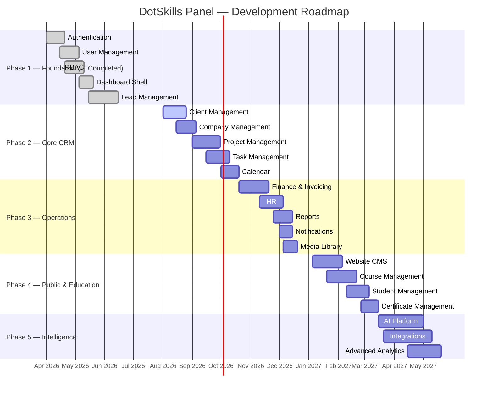

## 15.2 Phase Summary

| Phase | Theme | Key Deliverables | Status |
|---|---|---|:---:|
| **Phase 1** | Foundation | Authentication, Users, RBAC, Dashboard shell, Leads | 🟢 Completed |
| **Phase 2** | Core CRM | Clients, Companies, Projects, Tasks, Calendar | 🟡 In Progress |
| **Phase 3** | Operations | Finance, HR, Reports, Notifications, Media | 🔵 Planned |
| **Phase 4** | Public & Education | Website CMS, Courses, Students, Certificates | 🔵 Planned |
| **Phase 5** | Intelligence | AI Platform, Integrations, Analytics | ⚪ Future |

---

# 16. Feature Status Matrix

**Legend:** 🟢 Completed &nbsp;·&nbsp; 🟡 In Progress &nbsp;·&nbsp; 🔵 Planned &nbsp;·&nbsp; ⚪ Future

| Module | Status | Phase |
|---|:---:|:---:|
| Authentication | 🟢 Completed | 1 |
| Authorization (RBAC) | 🟢 Completed | 1 |
| User Management | 🟢 Completed | 1 |
| Lead Management | 🟢 Completed | 1 |
| Dashboard Layout (Shell) | 🟢 Completed | 1 |
| Settings Foundation | 🟢 Completed | 1 |
| Dashboard Analytics/Widgets | 🔵 Planned | 2–3 |
| Client Management | 🟡 In Progress | 2 |
| Company Management | 🔵 Planned | 2 |
| Project Management | 🔵 Planned | 2 |
| Task Management | 🔵 Planned | 2 |
| Calendar | 🔵 Planned | 2 |
| Finance / Invoicing | 🔵 Planned | 3 |
| HR | 🔵 Planned | 3 |
| Reports | 🔵 Planned | 3 |
| Notifications | 🔵 Planned | 3 |
| Media Library | 🔵 Planned | 3 |
| Public Website (all 12 pages) | 🔵 Planned | 4 |
| Course Management | 🔵 Planned | 4 |
| Student Management | 🔵 Planned | 4 |
| Certificate Management | 🔵 Planned | 4 |
| Blog CMS | 🔵 Planned | 4 |
| Support Ticket System | 🔵 Planned | 3 |
| Audit Logs | 🔵 Planned | 3 |
| AI Roadmap (all 10 features) | ⚪ Future | 5 |
| Google Workspace / MS 365 | ⚪ Future | 5 |
| Slack / Discord | ⚪ Future | 5 |
| Zoom / Google Meet | ⚪ Future | 5 |
| Meta API | ⚪ Future | 5 |
| Stripe / SSLCommerz | 🔵 Planned | 3 |
| PayPal | ⚪ Future | 5 |
| Cloudinary | 🟢 Completed | 1 |

---

# 17. Priority Matrix

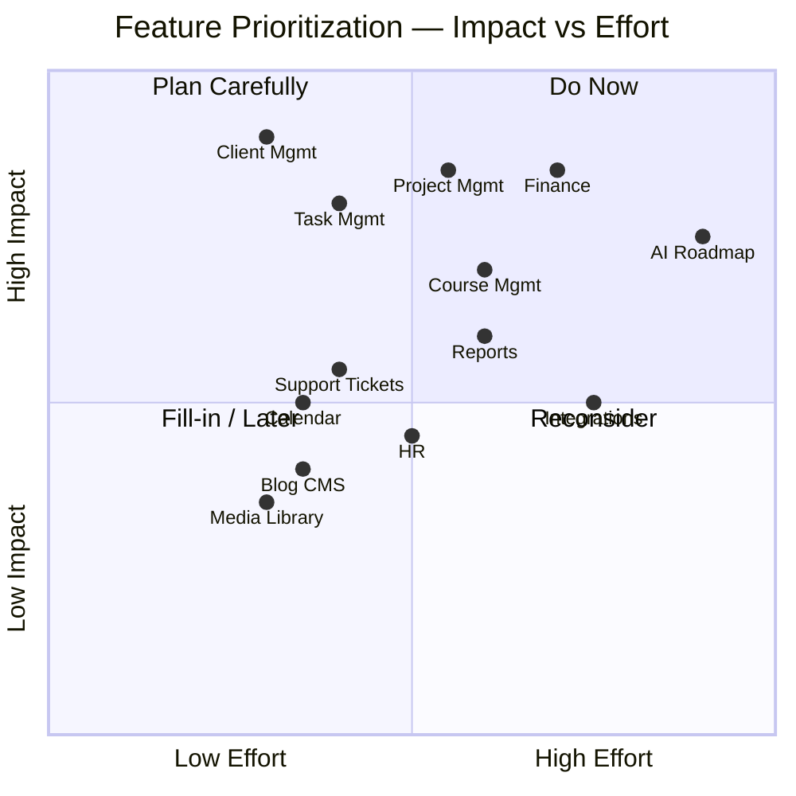

## 17.1 Priority Classification

| Priority | Definition | Examples |
|---|---|---|
| 🔴 **Critical** | Blocks core business operation or security | Auth, RBAC, User Mgmt *(all completed)* |
| 🟠 **High** | Directly drives revenue or delivery visibility | Client, Project, Task, Finance |
| 🟡 **Medium** | Improves operational efficiency, not blocking | Calendar, Reports, HR, Support Tickets |
| ⚪ **Low** | Nice-to-have, high value but not urgent | AI Roadmap, most Integrations |

---

# 18. Risk Assessment & Mitigation

## 18.1 Technical Risks

| Risk | Likelihood | Impact | Mitigation |
|---|:---:|:---:|---|
| MongoDB schema drift as modules grow | Medium | Medium | Shared Mongoose schema conventions (Section 4.3); schema review in PR checklist |
| Tight coupling between modules slowing Phase 2+ delivery | Medium | High | Module Dependency Diagram (3.4) enforced in architecture review; feature-based folder structure |
| Third-party API changes (Cloudinary, payment gateways) | Low | Medium | Wrapper/adapter layer around all external SDKs (Section 12) |

## 18.2 Security Risks

| Risk | Likelihood | Impact | Mitigation |
|---|:---:|:---:|---|
| Token theft via XSS | Low | High | Access token in-memory only, refresh token httpOnly cookie (Section 5.4) |
| Privilege escalation via misconfigured permissions | Medium | High | Centralized `canAccess()` guard (5.5); permission changes are Audit-Logged (10.16) |
| Brute-force login attempts | Medium | Medium | Rate limiting + account lockout threshold on `/auth/login` |
| Sensitive data exposure in API responses | Low | High | `select: false` on password/secret fields; response DTOs, never raw Mongoose documents |

## 18.3 Scalability Risks

| Risk | Likelihood | Impact | Mitigation |
|---|:---:|:---:|---|
| Unbounded list queries as data grows (Leads, Users) | Medium | Medium | Server-side pagination is mandatory on every list endpoint (already enforced in Leads/Users) |
| Single VPS backend becoming a bottleneck | Medium | High | Horizontal scaling path via load-balanced Node instances behind Nginx; stateless JWT auth supports this without session-affinity changes |
| MongoDB write contention on high-traffic collections | Low | Medium | Compound indexing (4.3); read replicas if/when read load requires it |

## 18.4 Performance Risks

| Risk | Likelihood | Impact | Mitigation |
|---|:---:|:---:|---|
| Large dashboard aggregation queries slowing page load | Medium | Medium | Cached summary endpoint with short TTL (8.3); background pre-computation for heavy reports |
| Unoptimized media inflating page weight | Medium | Low | Cloudinary automatic format/quality optimization, responsive `srcset` |

## 18.5 Mitigation Plan Summary

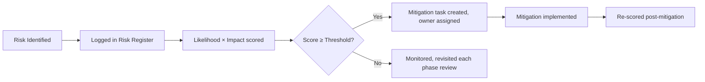

---

# 19. Non-Functional Requirements

| Category | Requirement |
|---|---|
| ⚡ **Performance** | API p95 response time < 300ms for standard CRUD; dashboard summary < 1s; LCP < 2.5s on public pages |
| 📈 **Scalability** | Stateless API tier scales horizontally; MongoDB indexed for projected 5-year data volume at design time |
| 🟢 **Availability** | Target 99.5% uptime for the API and dashboard; graceful degradation if a non-critical integration (e.g. Cloudinary) is unreachable |
| 🔐 **Security** | JWT + RBAC (Section 5); OWASP Top 10 mitigations; encrypted secrets at rest; HTTPS-only via Nginx/TLS |
| ♿ **Accessibility** | WCAG 2.1 AA target across the public website; keyboard-navigable dashboard |
| 🔍 **SEO** | Server-rendered/ISR public pages; structured data per page type (Section 9); auto-generated sitemap & robots.txt |
| 🛠️ **Maintainability** | Feature-based folder structure; strict TypeScript; shared component/utility layers (Sections 11–12) to avoid duplication |
| 📏 **Code Standards** | ESLint + Prettier enforced in CI; PR review required before merge; conventional commits |
| 📝 **Logging** | Structured server logs (request id, actor, latency); Audit Logs (10.16) for sensitive business actions |
| 📡 **Monitoring** | Uptime monitoring on API/frontend; error tracking (e.g. Sentry-class tool) wired into both frontend and backend |

---

# 20. Testing Strategy

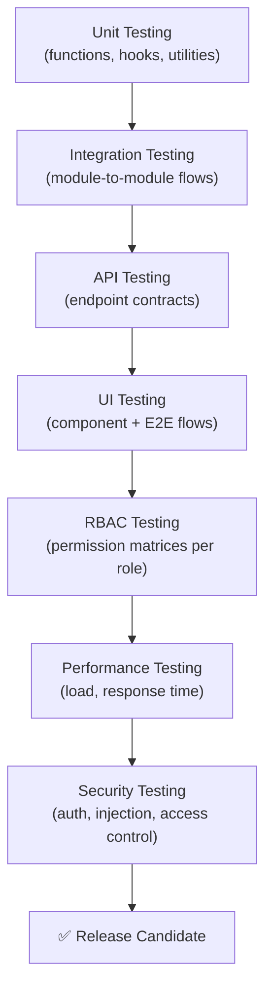

| Layer | Scope | Example Tooling Category |
|---|---|---|
| **Unit Testing** | Pure functions, RBAC helpers (Section 5.5/12), validation schemas | Jest/Vitest |
| **Integration Testing** | Multi-step flows — e.g. Lead → Client conversion, Task status transitions | Jest/Vitest + test DB |
| **API Testing** | Contract testing every REST endpoint — status codes, payload shape, error cases | Supertest / Postman collections |
| **UI Testing** | Component rendering, form validation, table interactions | React Testing Library |
| **RBAC Testing** | Every permissions matrix in Sections 6–10 verified per role (positive + negative cases) | Scripted role-matrix test suite |
| **Performance Testing** | Load testing list/aggregation endpoints under concurrent load | k6 / Artillery-class tooling |
| **Security Testing** | Auth bypass attempts, injection, IDOR checks on every `:id` route | Manual + automated scan |

## 20.1 RBAC Test Matrix Example (Leads)

| Test Case | Super Admin | Admin | Manager | Marketer | Staff (unassigned) |
|---|:---:|:---:|:---:|:---:|:---:|
| GET /leads returns full list | ✅ Pass | ✅ Pass | ✅ Pass | ✅ Pass | ❌ 403 expected |
| DELETE /leads/:id (soft) | ✅ Pass | ✅ Pass | ✅ Pass | ❌ 403 expected | ❌ 403 expected |
| DELETE /leads/:id/permanent | ✅ Pass | ✅ Pass | ❌ 403 expected | ❌ 403 expected | ❌ 403 expected |

---

# 21. Deployment Architecture

```mermaid
flowchart TD
    Dev["👩‍💻 Developer"] -->|git push| GH["🐙 GitHub Repository"]
    GH -->|webhook trigger| CI["⚙️ CI/CD Pipeline\n(lint · test · build)"]
    CI -->|deploy frontend| Vercel["▲ Vercel\n(Next.js 16 Frontend)"]
    CI -->|deploy backend| VPS["🖥️ Backend VPS\n(Node.js + Express, PM2)"]
    VPS --> Nginx["🌐 Nginx\n(Reverse Proxy + TLS)"]
    Nginx --> API["API Endpoints"]
    API --> Mongo[("🗄️ MongoDB")]
    API --> Cloud["☁️ Cloudinary"]
    Vercel -->|HTTPS| Nginx

    style Dev fill:#EEF2FF,stroke:#6366F1
    style GH fill:#F5F3FF,stroke:#8B5CF6
    style CI fill:#FDF4FF,stroke:#D946EF
    style Vercel fill:#F0F9FF,stroke:#0EA5E9
    style VPS fill:#ECFDF5,stroke:#10B981
    style Mongo fill:#FFFBEB,stroke:#F59E0B
    style Cloud fill:#FEF2F2,stroke:#EF4444
```

| Stage | Description |
|---|---|
| **Developer → GitHub** | Feature branches, PR review required, conventional commits |
| **GitHub → CI/CD** | Automated lint, type-check, test suite (Section 20) on every PR and merge to `main` |
| **CI/CD → Vercel** | Frontend auto-deployed on merge; preview deployments per PR |
| **CI/CD → Backend VPS** | Backend deployed via CI to VPS, process-managed (e.g. PM2), zero-downtime restart |
| **VPS → Nginx** | Reverse proxy terminates TLS, routes to the Node process, handles gzip/caching headers |
| **API → MongoDB** | Primary datastore, connection pooled, indexed per Section 4.3 |
| **API → Cloudinary** | All media reads/writes proxied through signed requests |

---

# 22. Appendix

## 22.1 Glossary

| Term | Definition |
|---|---|
| **RBAC** | Role-Based Access Control — permission model gating access by role and optional per-user overrides |
| **JWT** | JSON Web Token — signed token format used for stateless authentication |
| **Soft Delete** | Marking a record as deleted (`isDeleted: true`) without physically removing it from the database |
| **ISR** | Incremental Static Regeneration — Next.js pattern for re-generating static pages on a schedule/on-demand |
| **ODM** | Object-Document Mapper — Mongoose's role between application code and MongoDB |
| **SLA** | Service-Level Agreement — target response/resolution time, referenced in Support Tickets (10.13) |
| **NFR** | Non-Functional Requirement (Section 19) |
| **ICP** | Ideal Customer Profile — qualification criteria referenced in Lead Management (7.3) |

## 22.2 Abbreviations

| Abbreviation | Meaning |
|---|---|
| SRS | Software Requirements Specification |
| CRUD | Create, Read, Update, Delete |
| API | Application Programming Interface |
| CDN | Content Delivery Network |
| SEO | Search Engine Optimization |
| CMS | Content Management System |
| MTD / QTD / YTD | Month-to-Date / Quarter-to-Date / Year-to-Date |
| CI/CD | Continuous Integration / Continuous Deployment |
| WCAG | Web Content Accessibility Guidelines |

## 22.3 Version History

*(Mirrors the Revision History table on the title page — reproduced here for print/appendix convenience.)*

| Version | Date | Summary |
|---|---|---|
| 0.1.0 | 2026-05-12 | Initial draft |
| 0.5.0 | 2026-06-20 | Phase 1 modules documented post-implementation |
| 0.8.0 | 2026-07-18 | Roadmap, matrices, NFRs, testing strategy added |
| 1.0.0 | 2026-08-01 | Full baseline release |

## 22.4 References

- Internal reference implementation: DotSkills Panel frontend/backend repositories (sidebar, permissions, and dashboard components referenced throughout Sections 3, 5–10).
- Design system inspiration: Linear, Stripe Dashboard, Vercel, Clerk, Notion (Section 3, dashboard shell aesthetic).
- Schema.org structured-data vocabulary (Section 9, per-page SEO requirements).
- WCAG 2.1 guidelines (Section 19, accessibility NFRs).

## 22.5 Future Notes

- This SRS should be re-baselined (version bump to `2.0.0`) at the close of Phase 2 (Section 15), once Client/Company/Project/Task modules move from 🔵 Planned to 🟢 Completed.
- Sections 13 (AI Roadmap) and 14 (Integrations) are intentionally directional rather than fully specified — they will be expanded into their own detailed SRS addenda once Phase 5 scoping begins.
- Any deviation from this document during implementation should be logged back here via a revision entry, not left undocumented — this is meant to stay a living, accurate source of truth.

---

<div align="center">

### End of Document

**DotSkills Panel — Software Requirements Specification v1.0.0**
© 2026 DotSkills. All rights reserved. Confidential.

</div>
